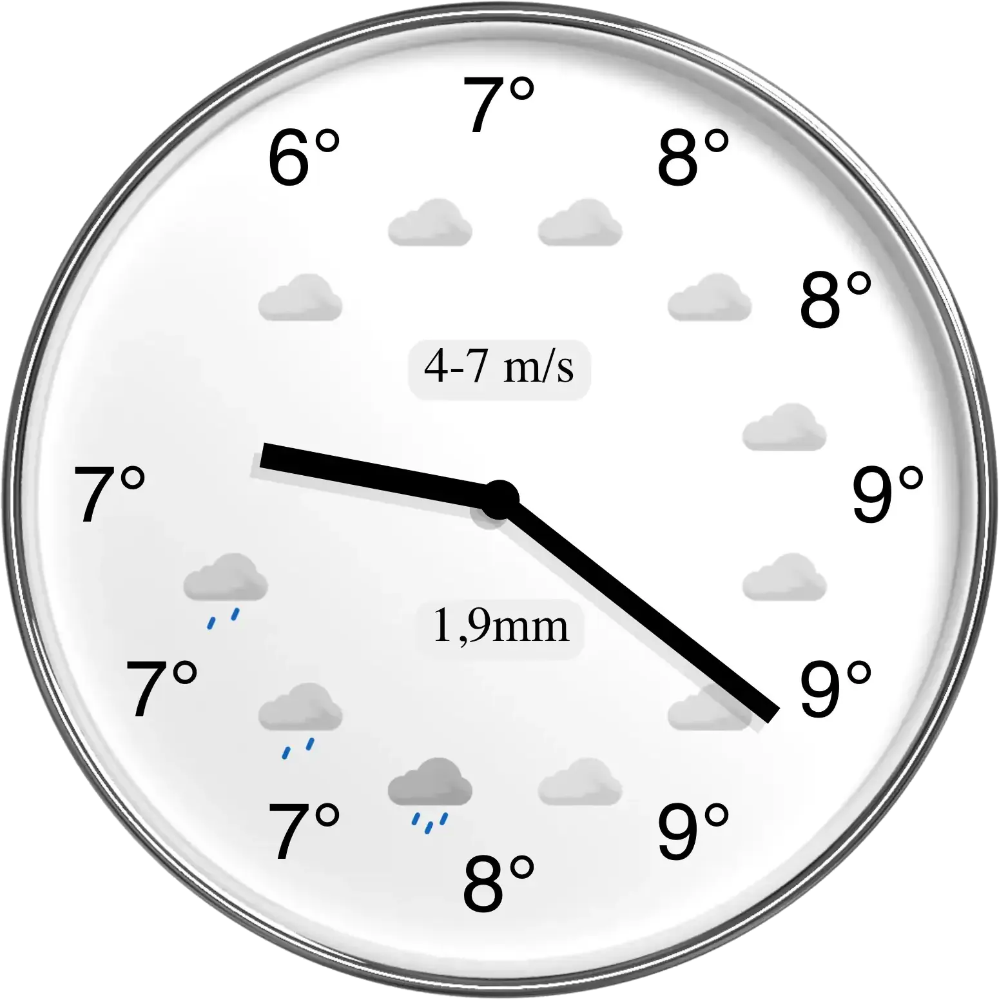

# Weather Clock

Try it here: <https://walles.github.io/weatherclock/>

[](https://walles.github.io/weatherclock/)

Displays the weather forecast for the upcoming 11 hours for the current location
on a clock face. On clear nights it shows northern ligths forecasts.

It shows temperature where ordinary clocks show hour numbers, and weather
symbols for each hour.

You can force a position using query parameters `?latitude=...&longitude=...`.

## Clock Face Graphics

To update the clock face graphics:

- Edit `src/images/clock-frame.blend` using [Blender](https://blender.org)
- Render and save as `public/clock-frame.png`

## Favicon

To update the favicon:

- Edit `src/images/weatherclock.xcf` using [GIMP](https://gimp.org/)
- Overwrite the following files with your changes:
  - `public/favicon.ico`
  - `public/logo192.png`
  - `public/logo512.png`
- Commit changes to `src/weatherclock.xcf` and the icons in `public/`

## Northern Lights Icons

To update the northern lights icons:

- Edit `src/images/aurora-icon.blend` using [Blender](https://blender.org)
- Enable Aurora Borealis II and render into `public/aurora-high.png`
- Disable Aurora Borealis II and render into `public/aurora-low.png`

## Running Locally (Development)

To start a local development server:

```fish
npm install && npm start
```

This will start the app at [http://localhost:5173](http://localhost:5173) and reload automatically on changes.

## Deploy

To deploy updates:

```fish
npm run deploy
```

This will build the app and publish it to the `gh-pages` branch for GitHub Pages hosting.

## Proxy

Since <yr.no>'s REST API doesn't (or didn't) support being run from browsers,
there's a Google Cloud Function proxying the requests. Source code lives in
the [proxy](proxy) directory.

## TODO

- Show toasts when:
  - Requesting geolocation
  - Geolocation failed
  - Geolocation succeeded
  - Requesting weather data
  - Weather data download failed
  - Weather data download succeeded
- Tick the hands automatically
- Consider now-vs-tomorrow dropdown placement on both narrow and tall screen
  layouts.
- Make the now-vs-tomorrow dropdown more visible?
- Report a page view each time the page becomes visible. Do we get an initial
  visibility event on page load?
- Report geolocation and weather download timings to Google Analytics
- Remove the Update button since updates should now be automatic

### DONE

- Test the geolocation-failed dialog, including its Retry button until it works
  to my satisfaction. To improve it somebody needs to explain to me how.
- Don't advertise we're downloading new forecasts if we already have them
- Keep the existing forecast if:
  - It is recent enough
  - We haven't moved too far
- If the user hides and re-shows the web page, update it
- Re-add Google Analytics
- Add a "Now" vs "Tomorrow" dropdown in the top right corner.

### NOT DOING

- Consider moving some logic from `componentDidMount()` and `componentDidUpdate()`
  into `render()`. Won't work; `render()` is not allowed to touch `state` or `props`.
- Re-add Facebook Share Button.

---

## Learn More

- [Vite Documentation](https://vitejs.dev/guide/)
- [React Documentation](https://reactjs.org/)
